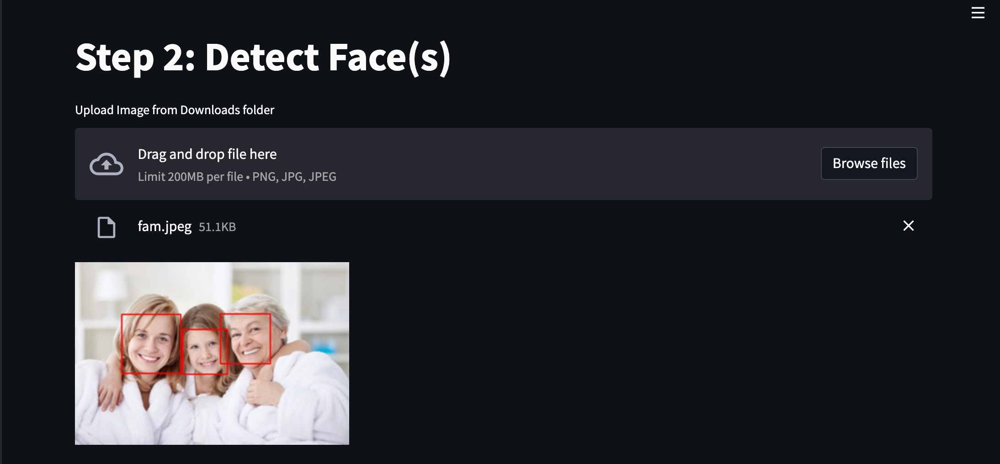
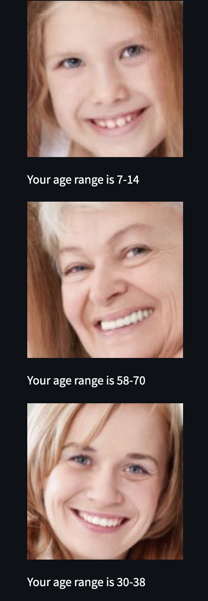

# age_detector
Streamlit application on which the age of a person can be predicted from an uploaded/webcam picture using a Convolutional Neural Network.

## Example




## Usage
Clone repository.

Install requirements using poetry install.

Run streamlit app. 

```bash
streamlit run stream_main.py
```

## Dataset and Resources
The CNN has been trained on the UKTFace large scale face dataset:
https://susanqq.github.io/UTKFace/

In preprocessed csv:
https://www.kaggle.com/nipunarora8/age-gender-and-ethnicity-face-data-csv?

Model based on insights from the following articles :
https://www.sciencedirect.com/science/article/abs/pii/S1077314220300424 
Prerak Agarwal, Age Detection using Facial Images: traditional Machine Learning vs. Deep Learning, 23 June 2020.

## Contributors
@heliabrull @victoirearena @camillebeguin @Martha-Braun
